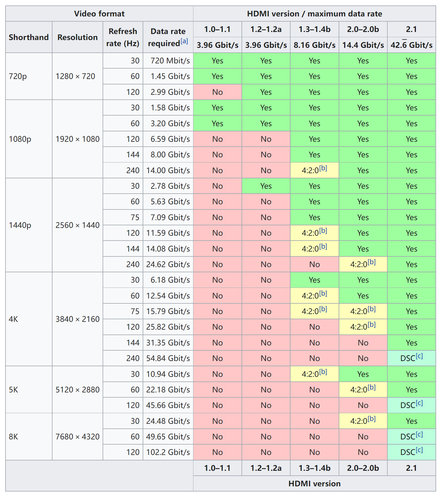

# 暑假购机推荐

> [!note] 温馨提示
> 
> - 本指南仅针对此前对电脑没有太多了解的同学，大神们可以忽略本篇文章
> - 垃圾佬或者希望采用某些奇怪方案的同学欢迎来交流
> - 如果你所在的地域无法使用 **国家补贴** 的话，可以考虑来杭州后使用浙江国补进行购机。2026 年国补还在继续，但规则有几处变化，务必看清楚：
>     - 笔记本 / 台式电脑归在 **一级能效家电** 类目下（和手机平板的"数码"类目是两套独立额度，可以分别申领），全国统一按最终成交价的 **15%** 补贴、**单件封顶 1500 元**
>     - **今年取消了二级能效补贴，只有一级能效机型才能参加**，所以不是每台笔记本都能用国补，下单前先看商详页有没有国补标识
>     - 每人每类产品全年限领 1 次，额度分批发放、先到先得，核销有效期至 2026 年 12 月 31 日
>     - 各地区、各平台的实际执行口径可能有出入（今年仍有部分商品页面挂着 20% 的补贴，多半是地方加码或活动叠加），一切以你下单时页面显示的金额为准
> - 有任何问题或想法都可以在图灵群里问，学长们可以给一些更详细的参考
> - 部分机型具体情况可以参考笔吧评测室的 [2026 年 618 购机指南](https://www.bilibili.com/video/BV1DaGy6GEQK/)（标题就叫"涨疯了"，足以概括今年行情），不过视频相对有点古早了
> - 牢牢记住一点：没有垃圾的产品，只有垃圾的价格！！！
> - 如果你不希望面临难以解决甚至无法解决的问题的话，请不要购买搭载非 Intel/AMD/Apple 处理器的笔记本电脑：既包括华为搭载麒麟处理器的机型（以及那个看起来很炫的折叠屏笔记本），也包括今年突然变多的骁龙 X2 系列 ARM 本。**特别提醒：去年指南里推荐过的华硕灵耀 14 Air，2026 款已经换成了骁龙平台**，不要照着去年的名字直接买。Windows on ARM 在 CS 学习场景下依然有大量兼容性坑（x86 工具链、虚拟机、各种课程软件），不要为了续航参数赌命
> - 一般不建议线下购买电脑，线上价格往往更低且配置更加透明
> - **今年最重要的一条**：受 AI 抢占存储产能影响，内存和固态硬盘从去年下半年起进入涨价"超级周期"，整机价格一路上涨且短期内看不到回落的迹象。往年"等大促 / 等开学季再买"的等等党策略今年基本失效，确定要买的话建议尽早出手

## 写在前面的话

我相信部分同学对于电脑的需求并非仅仅是在学习上的，而是附带有娱乐的需求。其实在大学中，除了游戏外大部分的使用场景并不需要太高的性能，大部分电脑都能够满足需求。如果你确定自己不会打游戏，或者说不会打大型游戏，一台 **轻薄本** 足矣，现在的核显机型的集成显卡性能大多不错（今年 Intel 新平台的核显甚至摸到了入门独显的水准），轻度乃至中度的游戏都能胜任。

而如果你想畅玩大作的话，就需要一台性能更加强劲的 **全能本**（或者是 **轻薄本 + 主机** 的方案）；同时鉴于从玉湖宿舍到东区教学区的通勤距离相对较远，续航和重量也是需要考虑的因素。因此如果预算有限的话，很难说存在一个完美的方案，所以本文将会从使用场景和需求出发，给出一些建议和推荐来供大家权衡。

最后必须单独交代一下今年的大背景：AI 数据中心把三星、海力士、美光的存储产能几乎抽干了（你的内存条和英伟达的 AI 芯片在抢同一条产线的产能，而你显然抢不过英伟达），DRAM 和 NAND 的合约价从去年下半年开始暴涨，多家机构预计这轮周期至少延续到 2027 年。传导到整机上的结果就是：热门机型比年初普遍贵了 15%~30%，不少新品"发布即涨价"，去年指南里 3500 元价位的推荐档今年已经接近绝迹。所以本文的所有价格都只是 **2026 年 7 月的快照**，且大概率只涨不跌，下单前请务必自己再查一遍实时价格。也正因如此，今年"买去年的老款"是性价比含金量最高的操作之一，后文会反复提到。

## 任务需求分析（Windows）

### 使用场景

大学中使用电脑的时候非常多，但是实际上基本对性能要求不高，多数情况下就是开个 vscode、开个 terminal 和挂一堆浏览器标签页，反倒是续航和重量是最应当被考虑的（相信没人会想背着好几公斤的电脑和板砖电源到处跑的吧）。

在学习上最吃性能的大概就是 vivado（你们写 FPGA 玩的时候就知道了），但是它的多线程优化挺烂的，所以更多的核心对你的学习没啥用。所以，对于不怎么打游戏（或者说不打 3A 游戏）的同学，需要的是一台稳定、轻便、续航好的轻薄本；对有较高游戏需求的同学来说，需要的是一台平衡性能、功耗、续航和重量的全能本（因此本人依旧不推荐任何使用 HX 处理器的笔记本）。

至于炼丹之类的事情，笔记本电脑显存撑死也就 24GB（还得是 5090 移动版那种天价机型），对于炼丹来说处于是基本不能用的情况（√）。真要炼丹的话实验室会给卡的（连卡都没有的话还是快逃吧）。

### 图形性能要求

如同前文所提到的，除非需要玩大型游戏，否则其实对图形性能的要求并不高。而且今年核显阵营有了质的飞跃：Intel 新一代酷睿 Ultra 300 系列里带 X 前缀的处理器集成了 12 Xe 核心的锐炫 B390 核显，配合 XeSS 3 多帧生成，官方口径直逼 RTX 4050、第三方评测普遍认为在入门独显（3050 级别）的水准——也就是说，一台核显轻薄本现在真的可以中画质跑一跑 3A 了，"不想背游戏本但偶尔想玩"的同学上限比往年高了不少。

如果刚需独立显卡的话，需要注意今年英伟达 **没有发布新的笔记本显卡**，市面上仍然是 RTX 50 系。50 系显卡根据封装（强关联着性能、功耗）分成两个档次：BD2 的主流甜点卡 RTX 5050/5060/5070、BD1 的旗舰 / 次旗舰显卡 RTX 5070Ti/5080/5090。5070Ti 和 5070 看似只差了个尾缀，但实际的性能差距还是比较大的，而 5060 和 5070 的差距实际上并不大，对于这三个主流价位的显卡配置，需要仔细考虑。去年还能捡漏的 40 系清仓机今年已经基本清完了，遇到价格合适的 4060 机型也不是不能买，但要仔细核对内存硬盘规格，防止清库存减配。

### CPU 性能需求

总体来说，日常使用中需要高 CPU 负载的场景并不多。如果你需要玩大型单机游戏，那么一般来说显卡性能对于游戏帧率的影响更大一些，CPU 只要是 N-1 或 N-2 代（N-1 代指上一代，N-2 代指上上一代）的主流标压处理器就足够了——今年游戏本里大量的 14 代酷睿 HX、锐龙 8940HX/8945HX 系机型就是这个定位，配合国补价格非常香。

如果你需要玩大型网游，比较吃的是 CPU 的单核性能，这时候选择最新一代的 CPU 确实会有更好的体验；如果你追求极致的帧率，可以选择 AMD 家带 3D V-Cache 的处理器，目前国内在售的移动端仍然只有 Ryzen 9 9955HX3D 这一个选择，且搭载它的都是价格很高的旗舰游戏本。

此外，如果你有视频剪辑的需求的话，Intel 的 CPU 有着更好的硬件加速支持，对比 AMD 的处理器，在同一张显卡的情况下，视频处理速度上会快上不少。如果刚需 Windows 并且想要长续航，今年的答案是 Intel Panther Lake（酷睿 Ultra 300 系列）：它同时继承了 Lunar Lake 的能效和 Arrow Lake 的性能，官方标称续航最长 27 小时（厂商实验室数据，实际使用请打折看待）；而去年的续航神 U 酷睿 Ultra 200V 系列（Lunar Lake）如今在清仓机型上依然是好选择。

### 内存需求

这部分是今年被涨价冲击最狠的地方。鉴于 Windows 11 比较臃肿，16GB 内存可能会出现不太够用的情况，出于中远期使用规划的考虑，我们依然建议一步到位买 32GB 的版本——好消息是今年大部分主流轻薄本都把 32GB 做成了标配（厂商也知道你以后加不起），坏消息是这些"标配"的价格已经把内存涨价算进去了。

需要特别提醒的是：往年"买 16GB 版本回来自己加内存条"的省钱操作今年基本失效了，单条 32GB DDR5 的零售价比去年同期涨了数倍，自行升级的差价空间已经被抹平甚至倒挂，直接买目标容量的版本反而更省心。另外今年出现了一些 24GB 的"新丐版"配置，属于厂商在成本压力下的折中，能上 32GB 还是尽量上 32GB。对于确实要买可拆卸内存机型的同学，动手时一定要规范断电操作；另外今年联想在 ThinkBook 上用上了 LPCAMM2 模块化内存（低功耗高频率、且日后可换），算是涨价年代里为数不多对消费者友好的新东西。

### 硬盘需求

512G 的硬盘大概率是不太够用的（对于 Windows 本来说），如果有第二个硬盘位的话可以之后来加，没有的话建议还是买 1T 的版本。固态硬盘和内存一样在涨价，今年 2T 版本的溢价普遍比较离谱，除非重度游戏玩家否则不必硬上——反复删载游戏在学校网络的小水管下并不是很好的体验，但为 2T 多花一千多块也未必划算，自己权衡。双盘位机型（本文推荐里会标注）在这个年代的价值明显上升了。

### 扩展接口需求

很多同学可能会对笔记本上的扩展接口感到迷茫，下面我将做个简单的介绍。

在物理规格上主要分为 Type-A 和 Type-C。Type-A 就是大家熟悉的长方形的 USB 接口，Type-C 就是手机上那种扁的接口。

Type-A 口受限于物理限制，一般都是工作在 5Gbps 的速率；主要用途是拿来插键鼠（bushi），一般有 1-2 个就足够了。需要注意的是，5Gbps 的 USB3.0 接口使用的频率范围接近 2.4GHz，会产生一定的电磁干扰，可能影响 2.4GHz 无线键鼠、无线耳机等设备的使用，接无线接收器的时候尽量避开高速 USB 设备旁边的口。

Type-C 口时至今日依然没能够完成统一大业，不同设备的 C 口支持的传输速率和充电速率大不相同，传输速率从 5～120Gbps 不等，供电功率按 USB PD 3.1 标准最高可至 240W（笔记本上常见的是 65～140W）。对于 2026 年的大部分笔记本来说，至少有一个 C 口是支持 USB4 协议、PD 充电协议以及 DP 视频输出功能，即所谓的全功能 C 口；但对于 Thunderbolt 协议的支持基本只出现在中高端机型上，原因是支持 Thunderbolt 的 C 口约需要 x4 的 PCI-E 通道，各方面成本较高，但速率高甚至能作外接显卡用。对于支持 PD 充电的 C 口，可以直接使用支持 PD 协议的充电器进行供电，如果使用 GaN 充电头来进行供电就可以只带一个小充电头和一条支持大电流的充电线通勤，降低通勤负重。对于 C 口的视频输出支持需要注意不同 C 口的视频输出通道可能不同，有可能一个口是核显输出，一个口是独显输出，会对外接显示器时调用的显卡产生影响。

注意，如果没有特殊的需求，其实不用太在意 USB 接口的传输速率，因为带宽瓶颈的使用场景很少，大部分场景是碰不到的，而且高速的 USB 设备价格也十分昂贵。但是在 2026 年，如果一台笔记本连全功能 C 口都没有，那么这台笔记本的模具大概是不值得你为它买单的。

另外提一句外接显卡：除了雷电口外，部分机型还带 OCuLink 或联想的 TGX 接口，可以用更低的协议开销外接显卡坞，对"轻薄本 + 显卡坞"方案感兴趣的同学可以留意（不过显卡坞方案整体价格不低，入坑前建议先来群里聊聊）。

出于方便的需要，到中后期不少同学可能会需要外接屏幕。一般笔记本会带一个 HDMI 接口或者全功能 C 口输出 DP 信号，一般来说能满足需求了。

注意，HDMI 协议和 DP 协议有不同版本，对传输速率会有影响，很多屏幕甚至于笔记本的 HDMI 接口只支持 HDMI1.4 或 HDMI2.0，分别不能够满血支持 2K 高刷和 4K 高刷，具体支持情况可以看下图的表格：

很多轻薄本为了轻薄都把 RJ45 网口给去掉了或者做成了折叠式的，大部分都不会有这方面需求的，再不行也能上拓展坞，因此不会有太大影响。

## 任务需求分析（macOS）

### 使用场景

与前面所说的 Windows 本类似，MacBook 在转向 Apple Silicon（即苹果 M 系列芯片）之后，性能和续航都有了质的飞跃，基本可以在大多数情况下不充电满足一整天的使用需求，如果不行再加一个 20000mAh 的支持 PD 协议的充电宝也一定行。

Mac 的触控板也是笔记本领域的顶尖水平，在熟练使用的情况下确实可以不用携带鼠标，因此可以极大的减轻通勤负重。Mac 的系统生态也相当完善（如果你在使用 iPhone、AirPods 等苹果生态产品，相信 Mac 应该是你的首要选择），很多软件都有对应的版本，甚至有些软件在 Mac 上运行得更好（例如 JetBrains 家的 IDE），同时 Mac 的 Unix 环境与 Linux 环境十分类似，还有 homebrew 这样的包管理器可以使用，开发体验个人感觉要比 Windows 好。

不足之处在于 Vivado（硬件课需要使用）、游戏和 PTA 考试系统了：

- Vivado 可以利用 Rosetta2 转译下的 Linux 版本运行，虽然性能会有一定损失，但并非完全不能跑。
- 游戏方面比去年又好了一些：《赛博朋克 2077》已经正式登陆 macOS 并且优化得还不错，越来越多的游戏开始原生支持 macOS 平台；实在不行也可以用 CrossOver 这样的软件转译（可能会有一定的 bug）。用 Mac 并不代表完全不能玩游戏，但大型网游和带内核级反作弊的游戏依然基本无解。
- PTA 的话如果 cyll 不更新一下就完全无解了，只能借用别人的 Windows 笔记本了（这条沿用往年的情况，入学后记得再跟学长确认一下最新状态）。

最后提一嘴价格：今年苹果面对存储涨价玩了一手"库克刀法"——直接砍掉小容量丐版，M5 MacBook Air 全系 512GB 硬盘起步，起售价 8499 元（比 M4 时期贵了 500 元）。看起来涨了，但叠加教育优惠和国补之后 13 寸 16+512 的实付价能压到 6000～7000 元区间，在今年 Windows 轻薄本集体涨价的背景下，Mac 的相对性价比反而是上升的。

### 图形性能需求

M3 之后的芯片在 GPU 3D 性能上有了很大的进步，由于统一内存带来的带宽和可用显存量的优势，M 系列芯片在图形性能上已经可以满足大部分同学的需求了。M5 进一步为每个 GPU 核心加入了神经网络加速器，AI 相关的负载提升明显。

并且由于媒体引擎在视频处理上的加速，M 系列芯片在视频处理上也有着非常好的表现。即使是深度学习相关的项目，由于 PyTorch 对 MPS 的支持已经非常完善，M 系列芯片也可以胜任部分深度学习推理任务的加速，项目迁移到 Mac 上也只需要加一两行代码。

### CPU 性能需求

M 系列芯片的 CPU 性能在轻薄本中已经是顶尖水平了，单核性能甚至超过了部分的桌面端处理器，多核性能也可以满足绝大部分的需求，因此对于大部分同学来说，M 系列芯片的 CPU 性能是足够的。对于有特殊需求的同学来说，Pro 和 Max 版本的芯片在多核性能上有着更好的表现。

### 内存需求

Mac 的内存从 16G 起步，16G 内存对于 Mac 的内存管理来说在大部分情况下都是足够的，你可以开几十个浏览器窗口的同时挂一堆程序在后台，甚至能跑 Q4 量化后的 14B 大模型。如果你有更高的需求，32G 内存的版本也可以满足大部分的需求，如果你有超过 32G 的需求，就必须加钱买 MacBook Pro 了。

需要注意的是，Mac 的内存是不可拆卸的，无法加装，因此在购买时需要考虑好未来的使用需求。16GB 的内存会导致内存压力长期较大，导致频繁读写交换分区，一定程度上会影响硬盘寿命。

### 硬盘需求

macOS 下垃圾文件不多，而且今年苹果把 Air 的起步硬盘直接提到了 512G，作为主力机基本够用了，这个曾经的痛点算是被涨价潮意外治好了。如果你不想买苹果的金子硬盘上更大容量，也可以选择外接硬盘的方案，Mac 的接口速率都不低，用起来除了麻烦些之外没有什么问题。最后如果 Mac 过保了之后，也是可以选择找人更换硬盘的，虽然价格不便宜，但比起苹果的金子硬盘还是便宜不少。

### 扩展接口需求

MacBook Air 自带的接口除了专门充电的 MagSafe 接口外有且仅有两个 USB-C 接口和 3.5mm 耳机接口，USB-C 接口支持 Thunderbolt 4 和 PD 充电协议，支持外接显示器和高速数据传输。M5 这一代还换上了苹果自研的 N1 无线芯片，支持 Wi-Fi 7 和蓝牙 6。如果你需要其他接口就必须要买拓展坞，不过如果不是对速率有要求可以不用买 Thunderbolt 拓展坞，直接买个 USB-C 的拓展坞就行了，前者的价格还是蛮贵的。

不得不提一下的是 3.5mm 耳机接口，Mac 的 3.5mm 耳机接口支持高阻抗耳机输出，推力非常猛，甚至可以直接驱动一些高阻抗的耳机和难推的耳机，某种程度上可以省一个台放。

MacBook Pro 相比之下就要富裕一点了，比 Air 多一个 USB-C 口、一个 HDMI 接口、一个 SDXC 卡槽，M5 Pro/Max 版本的 C 口为 Thunderbolt 5。同时有一个不依靠拓展坞输出视频的 HDMI 接口在连接教室投影的时候也会更方便更稳定。

## 部分产品推荐

> [!warning] 关于价格的重要说明 以下价位分类均基于 **国补后** 的价格，且为 **2026 年 7 月的快照**。今年价格波动极大（且方向基本是向上的），同时各地国补执行口径存在差异（15% 与 20% 的页面都能见到），本文中的到手价只能作为量级参考。**下单前请务必自查实时价格，出现较大出入请以实时价格为准。**

> [!warning] 本人并没有真正使用过以下产品，配置上比较明显的优缺点会写出来，但是具体是否适合各位同学，建议上网看看实机测评后再做决定，以下推荐仅供参考，还有很多好机型等待各位同学去发掘。另外同一型号往往有多个配置版本，本文列出的参数对应的是推荐配置，购买前请核对商详页

> [!tip] MacBook 和其他笔记本基本不在一个评价体系内，所以横向对比没什么价值，有意向购买 MacBook 的同学也可以随时在群里和用 Mac 的学长们交流

> [!note] 前置知识 目前市面上笔记本的 CPU 主要由 Intel、AMD 和 Apple 三家生产（当然也有骁龙 X 系列和开先、华为麒麟之类的产品，但对于 CS 学习来说可用性不高，前文已经劝退过了）。一般而言同模具笔记本 Intel 机型往往会比 AMD 机型更贵一些，但除去视频剪辑方面的劣势，AMD 处理器的性能和 Intel 相比并没有明显区别，因此选择 AMD 的机型一般而言是一个出于性价比的选择。
> 
> 目前主流 CPU 型号辨别（今年两家都换了新命名，比去年更迷惑了）：
> 
> - **AMD 锐龙 AI 400 系列**：今年 CES 刚发布的新移动旗舰（AI 9 HX 475 / AI 9 465 / AI 7 450 / AI 5 430 等），本质是锐龙 AI 300 的提频升级版，仍为 Zen5 CPU + RDNA 3.5 核显 + XDNA2 NPU（算力提到 60 TOPS，但对你的学习还是没啥用）。搭载机型今年上半年才陆续上市，溢价不低；
>     
> - **AMD 锐龙 AI 300 系列**：去年的主力，Zen5 架构大小核设计（大核 Zen5、小核 Zen5c，后者只是削减了三级缓存、降低了频率），中 U 高显，今年在清仓机型上性价比不错；
>     
> - **AMD 锐龙 200 系列**：不带 AI 的基本都是马甲。以最常见的 R7 H 255 为例，它就是 Zen4 的 8845HS 换名而来，8 核 16 线程 + 12CU 的 Radeon 780M 核显。注意这不代表不能买：Zen4 + 780M 的组合日常完全够用，今年反而是低价位轻薄本的性价比主力，只是别被"新系列"的名字骗了以为是新架构（同系列其他型号建议单独查一下规格再下手）；
>     
> - **AMD HX 系列**：桌面端移植，分离式 IOD 设计，在增大 L3 cache 的同时提高了功耗、降低了续航。9955HX/9955HX3D 为 Zen5 旗舰，8940HX/8945HX 为 Zen4 上代，今年上代 HX 配 5060 的游戏本是国补性价比重灾区（褒义）。出于平衡的考虑，依旧不推荐通勤党在笔记本上使用 HX 处理器；
>     
> - **AMD 锐龙 AI Max+ 系列**：395/392/388，强 U 强显 + 统一内存（最高 128G 内存动态分显存），本地跑 70B 大模型都够用，但搭载机型（ROG 幻 X、拯救者 R9000X 等）价格很高，性价比较差，尝鲜属性大于实用，不推荐；
>     
> - **Intel 酷睿 Ultra 300 系列（Panther Lake）**：今年 1 月上市的新一代移动端处理器，Intel 18A 工艺，同时接替 Lunar Lake（能效）和 Arrow Lake-H（性能）。命名规则：带 **X 前缀**（X7 358H / X9 388H）= 16 核 + 12Xe 满血 B390 大核显，核显性能入门独显级；**8 结尾不带 X**（如 Ultra 5 338H）= 12 核 + 10Xe 大核显，性价比甜点；**6 结尾**（336H/306H 等）核显规模缩水，更适合搭配独显或纯办公；30x 为低功耗系列。买核显本想玩游戏的话，认准 X 系或 338H。这代命名是真的迷惑（还有个因为产能问题降频 100MHz 换来的 X9 378H），**具体每颗 U 的核心数和核显规格建议去 Intel ARK 官网确认**；
>     
> - **Intel 酷睿 Ultra 200HX 系列及其 Refresh**：Panther Lake 这代没有 HX 型号，所以游戏本上今年用的是 Arrow Lake HX 的小改款（Ultra 7 251HX / 245HX 等），和桌面端同 DIE 但降压限功耗，性能强续航差，定位不变；
>     
> - **Intel 酷睿 Ultra 200V 系列（Lunar Lake）**：去年的续航神 U，全系片上内存不可更换（尾号 6 是 16GB、尾号 8 是 32GB），今年在清仓机型上依然值得买；
>     
> - **Intel 酷睿 Ultra 200H / 100H 系列**：上代和上上代主力（255H/225H/155H 等），今年清仓机型的性价比支柱；
>     
> - **Intel 酷睿 200H 系列**：注意是 **不带 Ultra** 的，13 代酷睿的 refresh 马甲，能耗比一般，不建议购买；
>     
> - **Intel 13/14 代 HX**：老将，i7-14650HX/i9-14900HX 配 50 系显卡的机型今年依然大量在售，游戏表现不输新 U，价格便宜不少；
>     
> - **Apple Silicon M 系列**：M 后面跟着的数字就是处理器的代数，数字后面的字母代表版本，Pro、Max 分别代表中高端和高端。今年 3 月 MacBook Air 更新到了 M5，MacBook Pro 也补齐了 M5 Pro/Max。M 系列的内存为片上内存不可更换，购买时需要考虑好未来的使用需求；采用 M 系列处理器的 Mac 只能运行 macOS，即使使用虚拟机也需要 Rosetta2 转译才能运行 x86 系统，性能上会有一定损失。
>     

> [!note] 省流
> 
> - 要较好的核显性能：Intel 酷睿 Ultra X7/X9（12Xe B390，目前核显天花板）、Ultra 5 338H（10Xe）、Ultra 200V 系列（清仓）；AMD 锐龙 AI 300/400（16CU 890M）、马甲 200 系的 12CU 780M（要求不高完全够）
> - 要极致的续航：Intel 酷睿 Ultra 300 系列、Ultra 200V 系列（清仓），Apple Silicon M 系列
> - 要极致的性能：Intel Ultra 200HX 系（251HX 等）/ 14 代 HX，AMD 9955HX/9955HX3D
> - 要极致的性价比：**去年的机型**——255H/225H 轻薄本、8845HS 马甲（R7 H255 等）轻薄本、14 代 HX 或锐龙 8940HX/8945HX 系 + RTX 5060 游戏本，能在国补价位捡到就是赚到

> [!warning] 提醒
> 
> - 华为目前仍搭载 x86 处理器的笔记本电脑默认出厂安装国产 Linux 系统，如果需要使用其他系统需要自行安装，需要一定动手能力。
> - 机械革命的笔记本虽然性价比总体较高，但此前多数产品的硬盘用的是 QLC 颗粒（一种价格低但是性能差寿命短的固态硬盘），选购时应当预见到可能存在的数据丢失风险。且这一品牌品控相对较差，选购的同学最好具备一定的动手能力。
> - 今年不要轻信"下个月大促会降价"：这轮涨价是成本驱动的，促销只是把涨幅稍微盖住一点。同理，警惕部分商家借涨价浑水摸鱼，把老款减配机（16G 内存 + 512G 硬盘 + 低色域屏）按新款价格卖，下单前把内存、硬盘、屏幕三项参数核对清楚。

### 5000 以内

去年这个位置写的还是"3500 以内"，今年通胀成这样也是没办法的事（

#### 「荣耀」MagicBook Pro 14 2025

参数

|项目|参数说明|
|---|---|
|**处理器**|Ultra 5 225H 处理器|
|**内存**|24GB / 32GB LPDDR5x 内存|
|**硬盘**|1TB 固态硬盘|
|**屏幕**|14.6 英寸，3120×2080 分辨率，100%DCI-P3，120Hz，OLED|
|**电池容量**|92Wh|
|**整机重量**|1.40kg|
|**适配器重量**|270g|

> [!success] 优势：大电池 + 荣耀续航调教，OLED 好屏，清仓价性价比极高

> [!failure] 劣势：屏幕反光明显，没有雷电接口，LPDDR 内存不可扩展

去年指南里 4500-5500 档的推荐机型，今年在涨价潮里反而成了 5000 内几乎唯一能打的高素质轻薄本（24G+1T 版参考到手价 4800～5100）。清仓机型有货就是赚到，看到合适价格不用犹豫太久，注意别买成 16G 的低配版。

#### 「机械革命」无界 14X 2026 斗战版

R7 H255 + 16G + 512G，首发 3179 元，国补后 2700 上下。一线品牌在 3000 价位已经基本绝迹，这台是真·预算有限同学的保底选择：处理器（8845HS 马甲）日常完全够用，代价是 16G 内存和 512G 硬盘（好在硬盘后期可以自己加）。屏幕等其余规格以商详为准，同时参考上面对机械革命的提醒。

### 5000——6500

#### 「荣耀」MagicBook 14 2026

参数

|项目|参数说明|
|---|---|
|**处理器**|Ultra 5 336H / Ultra X7 358H 处理器|
|**内存**|32GB LPDDR5x 内存|
|**硬盘**|1TB 固态硬盘|
|**屏幕**|14 英寸，2.8K 分辨率，高刷 LCD|
|**电池容量**|92Wh|
|**整机重量**|1.39kg|

> [!success] 优势：92Wh 大电池 + 荣耀 Turbo 调教续航极强，85W 性能释放激进，32+1T 标配

> [!failure] 劣势：336H 版核显规格一般（不是 X 系的 B390），品牌溢价低意味着二手残值也低

荣耀今年的"养虾本"，1.39kg 的机身塞了 92Wh 电池，336H 版国补后 5950 左右，是新平台机型里最便宜的入场券之一；另有 X7 358H 大核显版（国补后约 7500，属于下一档价位），适合想要核显玩游戏的同学。

#### 「联想」ThinkBook 14+/16+ 2026 锐龙版

R7 H255 / 锐龙 AI 7 H450 等多配置可选，24-32G + 1T，国补后大致 5000～6500 不等。ThinkBook 一贯的卖点：接口给得极全（RJ45、双全功能 C 口、双 A 口），扩展性好（可换内存 + 双硬盘位），模具均衡耐用。配置矩阵比较复杂，H255 版够日常用、AI 7 H450 版周边配置更全，下单前仔细对照商详，别多花冤枉钱。

### 6500——7500

#### 「机械革命」蛟龙 16 Pro 2026

参数

|项目|参数说明|
|---|---|
|**处理器**|R9 8945HX 处理器|
|**显卡**|RTX 5060 8GB 独立显卡（115W）|
|**内存**|16GB DDR5 内存|
|**硬盘**|1TB PCIe 4.0 固态硬盘|
|**屏幕**|16 英寸，2560×1600 分辨率，100%sRGB，180Hz，IPS|
|**电池容量**|80Wh|

> [!success] 优势：5060 游戏本的价格地板（参考到手价 6800 上下），双烤 200W 性能释放强

> [!failure] 劣势：16G 内存偏小，上代 HX 处理器续航差，品控参考前文提醒

今年 5060 游戏本的性价比标杆，适合预算有限但想玩 3A 的同学。另有 R9 9955HX 新 U 版本（参考到手价约 8800）以及 R7 H255 潮玩版低配（4800 起），丰俭由人。老规矩：HX + 独显的机器不适合天天背着跑通勤。

#### 「联想」拯救者 R7000P 2025

参数

|项目|参数说明|
|---|---|
|**处理器**|R9 8940HX 处理器|
|**显卡**|RTX 5060 8GB 独立显卡（115W）|
|**内存**|16GB DDR5 5200MT/s 内存|
|**硬盘**|1TB 固态硬盘|
|**屏幕**|16 英寸，2560×1600 分辨率，100%DCI-P3，240Hz，IPS|
|**电池容量**|80Wh|
|**整机重量**|2.36kg|
|**适配器重量**|695g|

> [!success] 优势：一线品牌 + 联想售后，散热优秀，各方面无明显短板

> [!failure] 劣势：机身不耐脏，没有 USB4，低负载时风扇会转

去年就在推荐的老将，参考到手价 7000 上下（清仓机型价格随库存波动较大，务必查实时价），比 2026 新款便宜出两千块左右而游戏表现差距很小，属于"买老款"逻辑的最佳代言人，适合有一定游戏需求且相信一线大牌的同学。

#### 「荣耀」MagicBook Pro 14 2026

参数

|项目|参数说明|
|---|---|
|**处理器**|Ultra 5 338H 处理器（另有 Ultra X7 358H / X9 388H 高配）|
|**内存**|32GB LPDDR5x 内存|
|**硬盘**|1TB 固态硬盘（双 M.2 2280 盘位）|
|**屏幕**|14.6 英寸，3120×2080 分辨率，3:2 比例，100%DCI-P3，120Hz，OLED 触控|
|**电池容量**|92Wh|
|**整机重量**|1.37kg|

> [!success] 优势：3:2 高素质 OLED 触控屏（这代加了低反涂层，反光改善明显），92Wh 续航极强，双盘位

> [!failure] 劣势：LPDDR 内存不可扩展，雷电口只有一个

338H 版国补后 6800 左右，新平台轻薄本里均衡度很高的一台，10Xe 核显 + 3:2 生产力屏 + 长续航，很适合不打大型游戏的同学作为主力机。

#### 「联想」ThinkBook 14+/16+ 2026 酷睿版

参数

|项目|参数说明|
|---|---|
|**处理器**|Ultra X7 358H 处理器|
|**内存**|32GB LPCAMM2 LPDDR5x 8533MT/s 内存（可更换，最高 96G）|
|**硬盘**|1TB PCIe 5.0 固态硬盘（双 M.2 盘位，另一个为 PCIe 4.0）|
|**屏幕**|14.5 英寸 3072×1920 120Hz / 16 英寸 3200×2000 165Hz，100%DCI-P3，500nits，IPS|
|**电池容量**|99.9Wh|
|**机身厚度**|约 15.9mm|
|**整机重量**|1.55kg（14+）/ 1.8kg（16+）|

> [!success] 优势：12Xe 满血 B390 核显 + 80/85W 性能释放同级最强，99.9Wh 电池（顶到民航随身携带上限），接口"十项全能"（双雷电 4 + TGX + RJ45），LPCAMM2 可换内存

> [!failure] 劣势：重量偏大，首发后价格持续上浮，热度高经常缺货

今年全能轻薄本的标杆机型：核显性能入门独显级、内存日后可换、双 M.2 盘位且标配 PCIe 5.0 硬盘，在涨价年代里是"一步到位用四年"思路的最优解之一。首发价 8299（14+）/ 8499（16+），国补后 7100 上下；7 月价格已有上浮，蹲到接近首发的价格就可以出手了。

#### 「机械革命」翼龙 15 Pro 2026

99Wh 大电池 + RTX 5060 的轻薄全能本路线（对，游戏本阵营也开始卷续航了），首发 7699 元起、国补后 6550 左右，适合有一定游戏需求且不想放弃轻便通勤体验的同学，定位类似去年推荐的天选 Air。新模具新产品线，建议多看两篇实机评测再下手。

### 7500——9000

#### 「联想」拯救者 Y7000P 2025

参数

|项目|参数说明|
|---|---|
|**处理器**|i7-14650HX / i9-14900HX 处理器|
|**显卡**|RTX 5060 8GB / RTX 5070 独立显卡|
|**内存**|16GB DDR5 内存|
|**硬盘**|1TB 固态硬盘|
|**屏幕**|16 英寸，2560×1600 分辨率，100%DCI-P3，240Hz，IPS|
|**电池容量**|80Wh|

> [!success] 优势：散热优秀、屏幕素质高，一线品控与售后

> [!failure] 劣势：16G 内存起步，14 代酷睿 HX 能耗比一般

一线品牌中一直卖得很好的机型，i7+5060 参考到手价 7200～7600、i9+5070 约 8200～8700（清仓价波动大，以实时价为准）。14 代 HX 虽是老 U 但喂饱 5060/5070 毫无压力，比 2026 款便宜出的两千多块拿去加内存换外设不香吗。

#### 「机械革命」极光 X 2026

参数

|项目|参数说明|
|---|---|
|**处理器**|Ultra 7 251HX 处理器（另有 245HX 潮玩版）|
|**显卡**|RTX 5060 / RTX 5070 独立显卡|
|**内存**|16GB DDR5 内存|
|**硬盘**|1TB 固态硬盘|
|**屏幕**|16 英寸，2560×1600 分辨率，300Hz，IPS|

> [!success] 优势：三风扇内吹散热，双烤 200W 释放，新 U + 高刷屏价格却不高

> [!failure] 劣势：品牌品控与 QLC 硬盘风险参考前文，键盘温度控制一般

8999 元起、国补后 7650 左右（245HX 潮玩版约 7200），是新一代 HX 处理器机型里最便宜的入场券之一，性能释放在同价位数一数二，适合追求极致性能性价比且动手能力强的同学。

### 9000 以上：新平台旗舰区

这个价位今年基本被"新平台 + 涨价"占领了，说实话性价比都不高，如果不是刚需新 U 的特性（Panther Lake 的续航 + 大核显、或者 251HX 的性能），大部分同学买上面价位段的机型体验差距很小。简单列几台：

- **「联想」拯救者 Y7000P 2026**：Ultra 7 251HX + RTX 5060/5070，模具小改款、散热依旧能打，补贴后万元上下。想要"新款拯救者"这块牌子的话就是它了。
- **「联想」小新 Pro 14/16 GT 2026**：Panther Lake 性能标杆（14 GT 为 Ultra 5 338H / X7 358H，16 GT 为 Ultra 5 338H / X9 388H），2.8K 1100nits OLED 好屏 + 92.5Wh（14 GT）大电池 + 双盘位 + PCIe 5.0 硬盘，机器本身非常好，可惜是"发布即涨价"的典型——3 月首发时国补后 6800 起，4 月起挂牌价直接上调 2500 以上，现在国补后 9000 起步。蹲到回落再买，按现价买属于给内存厂商上贡。
- **「机械革命」旷世 X 2026**：酷睿 7 245HX + 5060，32G+1T 版国补后约一万，堆料路线，适合明确需要 32G 内存 + 强释放的同学。

### 10000 以上

这个价位就不进行具体推荐了，只要避开外星人，在这个价位以上的笔记本基本都不会有太大的坑，当然也不会太有性价比，只要把配置和前面更加便宜的机型进行比较并且不买前几代的库存机型就行了，如果你拿捏不准的话，欢迎来进一步咨询。同时如果你的预算超过了两万块的话，也许 **轻薄本 + 台式机** 的配置会是一个让通勤和娱乐都更加舒适的选择（虽然今年装机的内存显卡也在涨价就是了），如果你有相关的想法也欢迎来咨询。

### Apple MacBook

> [!warning] 在一切之前 如前文所说，MacBook 在一些方面有着难以解决的问题，包括难以使用 Vivado、运行不了大部分游戏、无法使用 PTA 考试系统等。打算仅使用一本 MacBook 的同学需要慎重考虑一下这些问题。

翁恺老师曾经在程算的第一节课上说过，你们中一半以上的同学几年以后都会换用 MacBook。实际上高年级同学中也确实有越来越多的同学换了 MacBook，一些实验室也会为研究生同学配备 MacBook。MacBook 的键盘、触控板体验，macOS 的系统流畅度、使用体验以及开发体验再到苹果生态，整体和 Windows 笔记本都要有质的飞跃。预算充足且不反感 macOS 的同学可以尝试考虑。

但同时由于 macOS 对于大部分只使用过 Windows 的同学比较陌生，可以线下到 Apple 专卖店体验一下，包括挑选颜色、尺寸等都建议在线下先体验再线上通过国家补贴购买。苹果系列笔记本的参数可以直接在官网 [MacBook Air](https://www.apple.com.cn/macbook-air/) 和 [MacBook Pro](https://www.apple.com.cn/macbook-pro/) 对比查看。

今年 3 月 MacBook Air 更新到了 M5：全系 16G 内存 + 512G 硬盘起步（丐版被砍了），还换上了支持 Wi-Fi 7 的自研 N1 无线芯片，起售价 8499 元。叠加教育优惠（800 元起）+ 国补（15%、封顶 1500 元）后，13 寸 16+512 的实付价大致在 6100～6800 元，15 寸再加千元上下；如果还能碰到老款 M4 Air 的清仓渠道也很香。在 Windows 轻薄本集体涨价 15%~30% 的今年，Mac 是少数"相对变便宜"的选择，而且非常轻薄、续航超长，外出携带非常舒适。但 MacBook Air 并没有风扇散热，对性能要求比较高的同学可以加价购买 MacBook Pro 系列（M5 版 14 寸现在 1TB 起步 13499 元，M5 Pro 版 17999 元起）。

选配上：这代 Air 的 512G 起步存储作为主力机基本够用，苹果的金子硬盘（继续加容量非常贵）能不碰就不碰；内存 16G 日常够用，预算允许可以上 24G/32G，毕竟不可更换。芯片小幅升级和 Pro 的纳米纹理屏意义都不大，可以慎重考虑。

最后提示一点，购机之后一定要尽快购买 Apple Care+，初次购买为三年期，后续可继续无限期续费，服务期内可以享受不限次数的意外损坏修复、屏幕维修等，电池健康低于 80% 后还可免费更换电池。总之 Mac 是苹果产品中最有必要购买 AC+ 的，请务必及时购买。

> [!note] 使用建议
> 
> - 如果想开盖更换内存和硬盘的话，建议提前了解厂家保修策略。部分厂家可能会出现自行开后盖后不给保修的情况，大部分情况只要不拆坏机器还是可以保修的。
> - 对笔记本进行任何板级操作时都应当做好防护措施，避免发生短路或静电击穿事件造成不必要的财产损失甚至人身伤害。
> - 今年内存和固态的零售价非常离谱，"先买低配再自行升级"的差价优势基本消失，建议直接买目标容量的版本；确有升级需求的话，加装硬盘比加装内存划算一些。
> - 如果笔记本自带的是板砖式的电源，可以考虑买一个 65w-140w 的 GaN 的 PD 协议充电器（现在的笔记本基本普及了 C 口的 PD 充电），能让你携带笔记本外出时更加轻松。注意确认自己笔记本支持的最大 PD 功率，功率不足时高负载下可能出现掉电。
> - 如果笔记本出现故障，有保修的话直接联系购买时的客服（应该都是线上买电脑的对吧），如果没有保修的话一定谨慎到所谓的官方线下维修点去维修，基本上就是坑钱的。建议了解市场价格之后再综合研判，选择合适的维修渠道。
> - **续航调优：** 最简单的办法是在 Windows 的电源计划中将离电模式下的"处理器最大状态"调低（处理器工作频率 = 处理器基准工作频率 × 处理器最大状态，一般调低到 1.6GHz 是比较平衡的一个点），可以有效地提升续航时长。同时对于独显机型，一定要将显卡设置为核显输出，即暂时禁用独显，使用核显输出。
